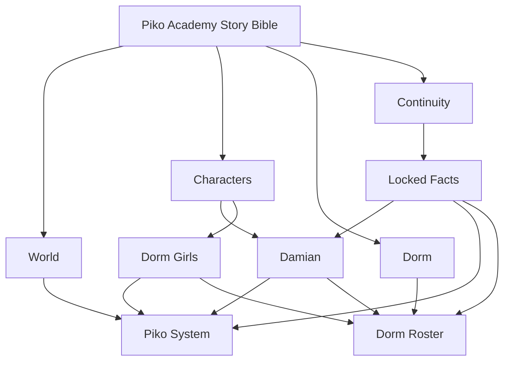

# Piko Academy Story Bible Index

> [!important] Canon Priority
> `Continuity/Locked Facts.md` is the highest-priority reference for established story facts. When live roleplay contradicts a locked fact, preserve the locked fact unless the Commander explicitly retcons it.

## Core Files

- [[World/Piko System|Piko System]]
- [[Characters/Damian|Damian]]
- [[Characters/Dorm Girls|Dorm Girls]]
- [[Dorm/Dorm Roster|Dorm Roster]]
- [[Continuity/Locked Facts|Locked Facts]]

## Obsidian Graph

## Working Rule

New details should be added first as **developing canon**. Promote them to **LOCKED CANON** only once they have been established in play or explicitly approved. This keeps improvisation flexible without letting continuity drift.